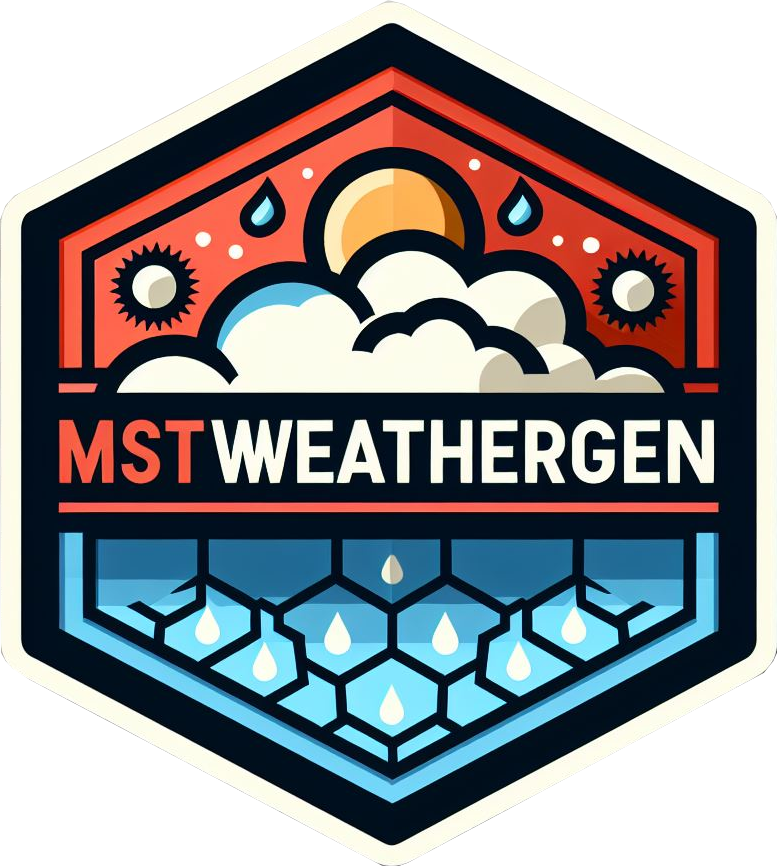

# MSTWeatherGen 

<!-- badges: start -->
[](https://github.com/sobakrim/MSTWeatherGen/actions/workflows/r-package-check.yml)
[](https://cran.r-project.org/package=MSTWeatherGen)
<!-- badges: end -->

## Overview

{MSTWeatherGen} Multivariate Space-Time Weather Generator package is designed for the simulation of multivariate spatio-temporal meteorological variables. It provides tools for estimating the model parameters and generating synthetic weather data that can be used for a variety of applications, including climate research, agricultural or hydrological modeling.  


## Installation

```r
# Install from CRAN
install.packages("MSTWeatherGEN")

# Or the development version from GitHub:
# install.packages("pak")
pak::pak("sobakrim/MSTWeatherGen")
```

## First use | Demonstration


## Funding / Referencies


## License

The package MSTWeather is under GNU GPL V3.   
See [LICENSE](LICENSE) file.  

## Authors

Saïd Obakrim  
Jean-François Rey  
